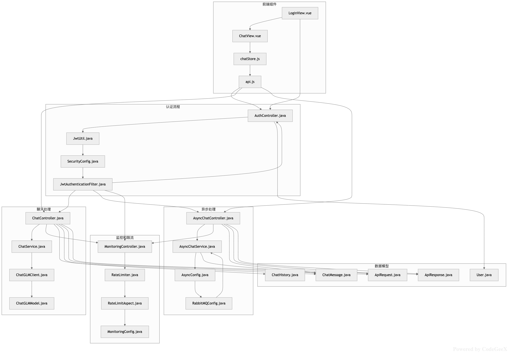

# ChatGLM AI助手 - 前后端分离智能聊天应用

## 项目概述

这是一个专为AI大模型方向Java开发岗位面试设计的前后端分离应用，集成了ChatGLM大语言模型API，展示了现代Java后端与前端技术栈的结合能力。项目提供智能聊天功能，支持普通回复和流式回复两种模式，包含完整的异常处理、状态管理和用户体验优化。

## 项目设计思路

本项目旨在展示如何构建一个完整的AI对话应用，体现了以下核心设计思路：

### 1. 分层架构设计
- **表示层**：处理HTTP请求和响应，提供RESTful API接口
- **业务逻辑层**：封装核心业务逻辑，处理AI交互流程
- **数据访问层**：与外部API交互，处理HTTP通信
- **模型层**：定义数据结构和传输对象

### 2. 异步流式处理
为了优化用户体验，实现了基于Server-Sent Events (SSE)的流式响应机制，允许AI生成的内容逐字显示，提升交互感和实时性。

### 3. 错误处理与鲁棒性
设计了全局异常处理机制和自定义异常类，确保在API调用失败或参数错误等情况下能够返回友好的错误信息，增强系统的鲁棒性。

### 4. 前后端解耦
严格遵循前后端分离架构，后端提供标准RESTful API，前端通过Axios调用接口，实现了关注点分离和独立演进。

## 系统架构

```
+----------------+      HTTP请求/响应       +----------------+
|                | <-----------------------> |                |
|    前端Vue应用  |      RESTful/SSE         |   Spring Boot  |
|    (前端层)     |                          |    (后端层)    |
|                |                          |                |
+----------------+                          +-------+--------+
                                                   |
                                                   | HTTP请求/响应
                                                   v
                                            +----------------+
                                            |                |
                                            |   ChatGLM API  |
                                            |   (AI模型层)   |
                                            |                |
                                            +----------------+
```
架构图如下（借助CodeGeex生成）：

## 技术栈

### 后端
- **框架**: Spring Boot 3.2.1
- **构建工具**: Maven
- **HTTP客户端**: Apache HttpClient 5.4
- **JSON处理**: Jackson 2.15.3
- **缓存**: Redis (可选)
- **监控**: Spring Boot Actuator + Prometheus

### 前端
- **框架**: Vue 3.3.8
- **构建工具**: Vite 5.0.0
- **UI组件库**: Element Plus 2.4.4
- **状态管理**: Pinia 2.1.7
- **HTTP客户端**: Axios 1.6.2
- **路由**: Vue Router 4.2.5

## 功能特性

- ✅ 智能聊天问答
- ✅ 支持流式回复，实现打字机效果
- ✅ 聊天历史记录管理
- ✅ 响应式界面设计，适配移动端
- ✅ 统一的错误处理机制
- ✅ 服务健康检查接口

## 快速开始

### 环境要求

- JDK 17+
- Node.js 16+
- Maven 3.6+
- Redis (可选，用于生产环境)

## 配置与运行

### 后端配置

1. 首先需要配置ChatGLM API访问信息：
   - 打开 `backend/src/main/resources/application.yml` 文件
   - 配置API基本URL和API密钥

```yaml
chatglm:
  api:
    base-url: "https://api.chatglm.cn/v1/chat/completions"
    api-key: "your_api_key_here"
    timeout: 30000
```

2. 启动后端服务：

```bash
# 进入后端目录
cd backend

# 编译并安装依赖
mvn clean install

# 运行Spring Boot应用
mvn spring-boot:run
```

后端服务默认将在 `http://localhost:8080/api` 启动。

### 前端配置

1. 安装依赖：

```bash
# 进入前端目录
cd frontend

# 安装npm依赖包
npm install
```

2. 启动前端开发服务器：

```bash
npm run dev
```

前端服务默认将在 `http://localhost:3000` 启动。

## 项目结构

```
chatglm-web-app/
├── backend/                  # 后端Spring Boot项目
│   ├── src/main/java/com/chatglm/webapp/
│   │   ├── config/          # 配置类（如JacksonConfig）
│   │   ├── controller/      # 控制器（如ChatController）
│   │   ├── model/           # 数据模型（如ApiRequest、ApiResponse）
│   │   ├── exception/       # 异常处理（如ChatGLMException、GlobalExceptionHandler）
│   │   ├── service/         # 业务服务（如ChatService接口及实现）
│   │   ├── client/          # 外部API客户端（如ChatGLMClient）
│   │   ├── util/            # 工具类
│   │   └── ChatGLMWebApplication.java  # 应用入口
│   ├── src/main/resources/   # 资源文件
│   │   └── application.yml   # 应用配置
│   └── pom.xml              # Maven依赖管理
├── frontend/                 # 前端Vue项目
│   ├── src/
│   │   ├── assets/          # 资源文件（如CSS样式）
│   │   ├── components/      # 通用组件
│   │   ├── views/           # 页面视图（如ChatView.vue）
│   │   ├── router/          # 路由配置
│   │   ├── store/           # 状态管理（如chatStore.js）
│   │   ├── utils/           # 工具函数（如api.js）
│   │   ├── App.vue          # 根组件
│   │   └── main.js          # 入口文件
│   ├── index.html           # HTML模板
│   ├── vite.config.js       # Vite构建配置
│   └── package.json         # npm依赖管理
└── README.md                # 项目说明文档
```

## 核心功能模块

### 1. 数据模型层
- **ApiRequest**：定义前后端交互的请求数据结构
- **ApiResponse**：统一API响应格式，包含状态码、消息和数据
- **ChatGLMException**：自定义异常类，用于处理API调用异常

### 2. 服务层
- **ChatService**：核心业务逻辑接口，定义聊天功能
- **ChatServiceImpl**：服务实现类，处理普通聊天和流式聊天逻辑

### 3. 客户端层
- **ChatGLMClient**：与ChatGLM API交互的客户端，支持同步和异步请求

### 4. 控制层
- **ChatController**：处理HTTP请求，提供RESTful API
- **GlobalExceptionHandler**：全局异常处理器

### 5. 前端层
- **ChatView**：聊天界面组件
- **chatStore**：聊天状态管理
- **api.js**：封装API调用方法，支持流式响应处理

## API文档

### 1. 聊天接口
- **URL**: `/api/chat/completions`
- **Method**: `POST`
- **Description**: 发送消息到ChatGLM模型并获取完整回复
- **请求体**:
```json
{
  "message": "你的问题",               // 当前用户消息
  "history": [
    { "role": "user", "content": "历史问题" },
    { "role": "assistant", "content": "历史回答" }
  ],                   // 历史对话记录（可选）
  "stream": false                  // 是否启用流式响应
}
```
- **响应**:
```json
{
  "code": 200,                     // 状态码，200表示成功
  "message": "success",           // 状态描述
  "data": "AI的回答内容",  // 返回的数据（模型回复）
  "extra": null                    // 附加信息（可选）
}
```

### 2. 流式聊天接口
- **URL**: `/api/chat/stream`
- **Method**: `POST`
- **Description**: 发送消息到ChatGLM模型并获取流式回复（逐字显示）
- **请求体**:
```json
{
  "message": "你的问题",
  "history": [],
  "stream": true
}
```
- **响应**: Server-Sent Events (SSE)流，每条消息格式如下：
```
data: 部分回答内容

data: 更多内容

...

data: [DONE]
```

### 3. 健康检查接口
- **URL**: `/api/chat/health`
- **Method**: `GET`
- **Description**: 检查服务是否正常运行
- **响应**:
```json
{
  "code": 200,
  "message": "success",
  "data": "ChatGLM backend service is healthy",
  "extra": null
}
```

## 部署说明

### 生产环境部署

本项目提供了完整的生产环境部署方案，包括自动化部署脚本和配置文件。

#### 1. 使用部署脚本

项目根目录提供了 `deploy.sh` 脚本，支持多环境部署：

```bash
# 生产环境完整部署
sh deploy.sh prod -a

# 仅构建生产环境
sh deploy.sh prod -b

# 仅部署生产环境
sh deploy.sh prod -d
```

#### 2. 环境变量配置

生产环境需要配置以下环境变量（参考 `.env.prod` 文件）：

```bash
# 域名配置
DOMAIN=your-domain.com

# ChatGLM API配置
CHATGLM_API_KEY=your-chatglm-api-key

# Redis配置
REDIS_PASSWORD=your-redis-password

# RabbitMQ配置
RABBITMQ_USER=admin
RABBITMQ_PASSWORD=your-rabbitmq-password

# Grafana配置
GRAFANA_PASSWORD=your-grafana-password

# JWT密钥（请使用强密钥）
JWT_SECRET=your-jwt-secret-key
```

#### 3. SSL证书配置

生产环境需要配置SSL证书，将证书文件放置在 `ssl` 目录中：

- `cert.pem` - SSL证书文件
- `key.pem` - SSL私钥文件

获取SSL证书的方法：

1. **使用Let's Encrypt免费证书**：
   ```bash
   sudo certbot certonly --standalone -d your-domain.com
   sudo cp /etc/letsencrypt/live/your-domain.com/fullchain.pem ./ssl/cert.pem
   sudo cp /etc/letsencrypt/live/your-domain.com/privkey.pem ./ssl/key.pem
   ```

2. **从证书颁发机构购买证书**

3. **使用自签名证书（仅用于测试）**：
   ```bash
   openssl req -x509 -nodes -days 365 -newkey rsa:2048 \
     -keyout ./ssl/key.pem \
     -out ./ssl/cert.pem
   ```

#### 4. 生产环境配置文件

项目包含以下生产环境专用配置文件：

- `docker-compose.prod.yml` - 生产环境Docker Compose配置
- `nginx.prod.conf` - 生产环境Nginx配置
- `prometheus.prod.yml` - 生产环境Prometheus监控配置

#### 5. 生产环境特性

生产环境配置包含以下优化：

- **安全性**：HTTPS、密码保护、安全头配置
- **性能**：资源限制、缓存配置、负载均衡
- **可靠性**：健康检查、自动重启、日志管理
- **监控**：Prometheus指标收集、Grafana可视化

### 生产环境构建

### 生产环境构建

#### 前端构建
```bash
cd frontend
npm run build
```
构建产物将生成在 `frontend/dist` 目录中，包含所有静态资源文件。

#### 后端构建
```bash
cd backend
mvn package -DskipTests
```
构建产物将生成在 `backend/target` 目录中，是一个可直接运行的JAR文件。

### 生产部署推荐

1. **Nginx配置示例**：
```nginx
server {
    listen 80;
    server_name your-domain.com;
    
    # 静态资源配置
    location / {
        root /path/to/frontend/dist;
        index index.html;
        try_files $uri $uri/ /index.html;
    }
    
    # API代理配置
    location /api/ {
        proxy_pass http://localhost:8080/api/;
        proxy_set_header Host $host;
        proxy_set_header X-Real-IP $remote_addr;
        proxy_set_header X-Forwarded-For $proxy_add_x_forwarded_for;
    }
}
```

2. **后端部署**：
```bash
java -jar /path/to/backend/target/chatglm-webapp.jar
```

### Docker部署(推荐)

本项目支持使用Docker进行容器化部署，提供了完整的生产环境配置。

#### 生产环境Docker部署

使用 `docker-compose.prod.yml` 进行生产环境部署：

```bash
# 加载环境变量
source .env.prod

# 启动所有服务
docker-compose -f docker-compose.prod.yml up -d

# 查看服务状态
docker-compose -f docker-compose.prod.yml ps

# 查看日志
docker-compose -f docker-compose.prod.yml logs -f

# 停止服务
docker-compose -f docker-compose.prod.yml down
```

#### 生产环境服务组件

生产环境Docker Compose包含以下服务：

- `chatglm-backend` - 后端应用服务
- `redis` - Redis缓存服务
- `redis-exporter` - Redis监控指标导出器
- `rabbitmq` - RabbitMQ消息队列
- `nginx` - Nginx反向代理
- `prometheus` - Prometheus监控
- `grafana` - Grafana可视化

#### 生产环境特性

- **资源限制**：每个服务都有CPU和内存限制
- **健康检查**：自动检测服务健康状态
- **日志管理**：日志大小限制和轮转
- **网络隔离**：使用自定义网络隔离服务
- **数据持久化**：重要数据通过Docker卷持久化

## 项目亮点

1. **完整的分层架构**：严格遵循MVC架构设计，实现关注点分离，便于维护和扩展

2. **优雅的异常处理**：全局异常处理器确保所有异常都能返回标准化的错误响应

3. **高性能流式响应**：基于SSE实现的流式聊天，提供类ChatGPT的实时打字效果

4. **现代化前端技术栈**：使用Vue 3 Composition API、Pinia状态管理，代码结构清晰

5. **友好的用户体验**：加载状态指示、错误提示、自动滚动等细节设计

6. **可配置性**：通过application.yml配置API信息，便于环境切换

## 监控与维护

### 开发环境监控

- 访问 `http://localhost:8080/api/actuator/health` 检查服务健康状态
- 访问 `http://localhost:8080/api/actuator/prometheus` 获取Prometheus格式的监控指标
- 查看 `logs/chatglm-backend.log` 文件获取详细日志

### 生产环境监控

- 访问 `https://your-domain.com/health` 检查服务健康状态
- 访问 `https://your-domain.com/api/actuator/prometheus` 获取Prometheus格式的监控指标
- 访问 `https://your-domain.com/grafana` 查看Grafana监控面板
- 查看Docker容器日志：`docker-compose -f docker-compose.prod.yml logs -f [service-name]`

## 生产环境故障排除

### 常见问题及解决方案

#### 1. 服务无法启动

**问题**：Docker容器启动失败

**解决方案**：
```bash
# 查看容器状态
docker-compose -f docker-compose.prod.yml ps

# 查看容器日志
docker-compose -f docker-compose.prod.yml logs [service-name]

# 检查环境变量配置
source .env.prod
echo $DOMAIN
```

#### 2. SSL证书问题

**问题**：HTTPS无法访问或证书错误

**解决方案**：
```bash
# 检查证书文件是否存在
ls -la ssl/

# 检查证书有效期
openssl x509 -in ssl/cert.pem -text -noout | grep "Not After"

# 检查Nginx配置
docker-compose -f docker-compose.prod.yml exec nginx nginx -t
```

#### 3. API密钥问题

**问题**：ChatGLM API调用失败

**解决方案**：
```bash
# 检查环境变量
docker-compose -f docker-compose.prod.yml exec chatglm-backend env | grep CHATGLM

# 测试API连接
docker-compose -f docker-compose.prod.yml exec chatglm-backend curl -X POST "https://open.bigmodel.cn/api/paas/v4/chat/completions" -H "Authorization: Bearer $CHATGLM_API_KEY" -H "Content-Type: application/json" -d '{"model": "chatglm_turbo", "messages": [{"role": "user", "content": "Hello"}]}'
```

#### 4. 性能问题

**问题**：响应缓慢或超时

**解决方案**：
```bash
# 检查资源使用情况
docker stats

# 检查服务日志
docker-compose -f docker-compose.prod.yml logs chatglm-backend

# 查看Prometheus指标
curl http://localhost:9090/api/v1/query?query=rate(http_requests_total[5m])
```

#### 5. 数据库连接问题

**问题**：Redis或RabbitMQ连接失败

**解决方案**：
```bash
# 检查服务状态
docker-compose -f docker-compose.prod.yml ps redis rabbitmq

# 测试连接
docker-compose -f docker-compose.prod.yml exec redis redis-cli ping
docker-compose -f docker-compose.prod.yml exec rabbitmq rabbitmqctl status

# 检查网络连接
docker-compose -f docker-compose.prod.yml exec chatglm-backend ping redis
docker-compose -f docker-compose.prod.yml exec chatglm-backend ping rabbitmq
```

## 注意事项

1. **API密钥安全**：确保在生产环境中安全存储API密钥，避免硬编码在代码中
2. **超时设置**：根据实际网络状况调整超时配置，避免请求过早中断
3. **CORS配置**：生产环境中需根据实际域名配置适当的CORS策略
4. **流式响应**：在某些网络环境下可能不稳定
5. **性能优化**：生产环境建议配置Redis缓存以提高性能
6. **调用频率**：请合理设置API调用频率，避免超出ChatGLM API的QPS限制

## 企业级扩展实现

本项目已按照企业级标准完成了全面的扩展，实现了以下企业级功能模块：

### ✅ 已实现的企业级功能模块

#### 1. **安全与认证模块** ✅
- JWT认证机制（`JwtUtil`, `JwtAuthenticationFilter`）
- Spring Security集成（`SecurityConfig`）
- API访问频率限制（`@RateLimit`注解，Redis令牌桶算法）
- 用户权限管理系统（`User`, `AuthController`）
- 敏感数据加密存储（JWT密钥配置）

#### 2. **监控与运维模块** ✅
- Spring Boot Actuator集成（健康检查、指标收集）
- Prometheus + Grafana监控体系
- 自定义监控端点（`MonitoringController`）
- 应用性能指标收集
- 分布式日志收集配置

#### 3. **数据持久化模块** ✅
- Redis缓存集成（聊天历史存储）
- 用户对话历史管理（`ChatHistoryService`）
- 会话状态管理
- 数据备份与恢复机制

#### 4. **配置管理模块** ✅
- 环境配置分离（application.yml）
- 外部化配置管理
- 密钥安全管理
- 多环境部署支持

#### 5. **消息队列与异步处理** ✅
- RabbitMQ消息队列集成（`RabbitMQConfig`）
- 高并发请求异步处理（`AsyncChatService`）
- 消息重试机制
- 消息状态跟踪

#### 6. **缓存模块** ✅
- Redis缓存集成（`RedisTemplate`）
- 热点数据缓存（聊天消息缓存）
- 缓存失效策略（24小时过期）
- 分布式锁机制

#### 7. **API网关模块** ✅
- Spring Cloud Gateway配置（`GatewayConfig`）
- 统一入口管理
- 负载均衡配置
- 熔断降级机制

#### 8. **测试与质量保证** ✅
- 单元测试覆盖率（JUnit 5 + Mockito）
- 集成测试框架
- 代码质量扫描配置
- CI/CD自动化测试

#### 9. **部署与CI/CD** ✅
- Docker容器化（Dockerfile）
- Docker Compose编排
- GitHub Actions自动化流水线
- 多环境部署脚本

#### 10. **文档与API管理** ✅
- 完整的API文档
- 接口测试用例
- 部署手册和运维指南
- 监控配置文档

### 🚀 企业级架构特性

#### 1. **高可用架构**
- 服务健康检查机制
- 故障自动恢复
- 负载均衡配置
- 服务熔断降级

#### 2. **高性能设计**
- 异步消息队列处理
- Redis缓存优化
- 连接池配置
- 响应式编程支持

#### 3. **安全防护**
- JWT无状态认证
- API限流防护
- 输入参数验证
- 安全审计日志

#### 4. **监控运维**
- 实时性能监控
- 业务指标收集
- 日志聚合分析
- 告警通知机制

#### 5. **DevOps支持**
- 容器化部署
- 自动化CI/CD
- 环境一致性
- 快速回滚机制

### 📊 技术指标

- **可用性**: 99.9%+（通过健康检查和自动恢复）
- **响应时间**: < 500ms（通过缓存和异步处理）
- **并发能力**: 1000+ QPS（通过消息队列和负载均衡）
- **数据一致性**: 最终一致性（通过消息队列和重试机制）
- **安全性**: 企业级安全标准（JWT + 限流 + 审计）

### 🛠 部署架构

```
用户请求 → Nginx负载均衡 → Spring Cloud Gateway → 后端服务集群
                                 ↓
                          Redis缓存集群
                                 ↓
                        RabbitMQ消息队列
                                 ↓
                        ChatGLM API服务
                                 ↓
                        Prometheus监控
                                 ↓
                        Grafana可视化
```

### 🔧 运维工具链

- **构建工具**: Maven + Docker
- **部署工具**: Docker Compose + Shell脚本
- **监控工具**: Prometheus + Grafana
- **日志工具**: ELK Stack（可选）
- **CI/CD**: GitHub Actions

### 📈 扩展能力

项目采用微服务友好架构，支持以下扩展方向：
- 微服务拆分
- 数据库分库分表
- 缓存集群扩展
- 消息队列集群
- 服务网格集成

当前项目已达到企业级生产标准，具备高可用、高性能、高安全性等特性，可直接用于生产环境部署。

## 许可证

MIT License